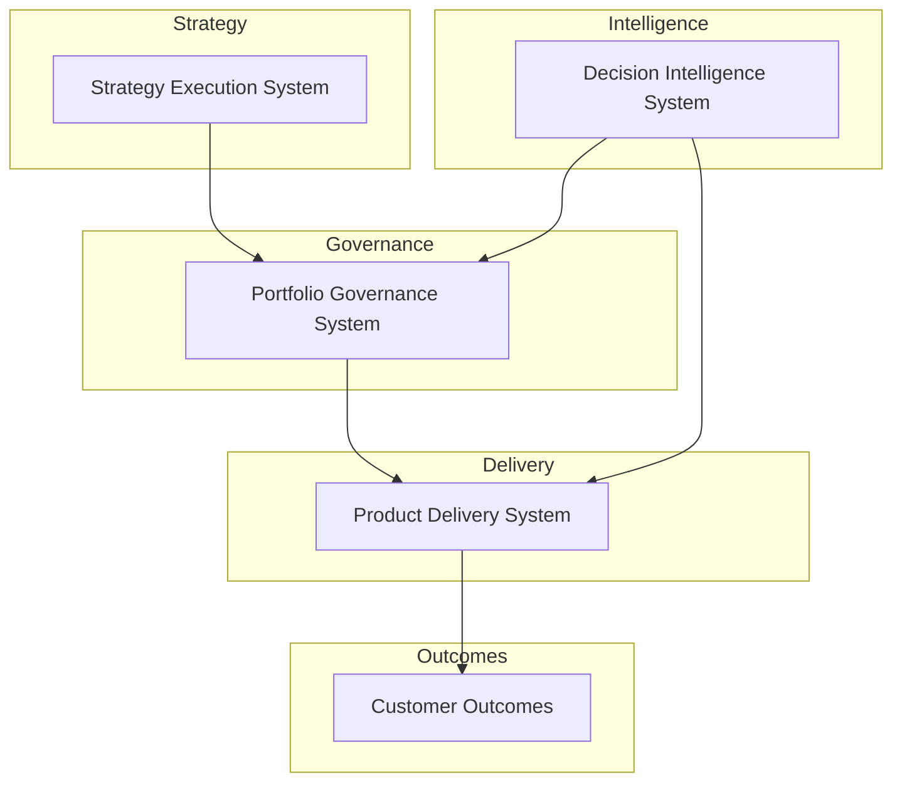

 # Product Leadership Systems Architecture

Documentation portal and architecture index for executive operating systems used to run modern product organizations.

---

## 10-Second Overview

This portfolio presents a coherent **Product Leadership Systems Architecture**:

- Strategy is translated into investable initiatives
- Investments are governed through portfolio decision systems
- Delivery is executed through a repeatable product operating model
- Outcomes are measured and fed back into governance
- Decision Intelligence augments governance and delivery with AI-assisted analysis

---

## System Architecture Model



---

## System Responsibilities

| System | Primary Responsibility |
|------|------|
| Strategy Execution System | Translates enterprise strategy into initiatives and investment candidates |
| Portfolio Governance System | Prioritizes investments, allocates capital, and manages portfolio risk |
| Product Delivery System | Governs execution of funded initiatives through the product operating model |
| Decision Intelligence System | Provides analytics and AI-assisted insights supporting executive decisions |

---

## System Repositories

| System | Primary Outputs | Repository |
|---|---|---|
| Strategy Execution System | Strategy decomposition, initiative definition, planning cadence | https://github.com/ChuckFerrando/strategy-execution-system |
| Portfolio Governance System (Flagship) | Portfolio scoring, capital allocation, risk scoring, investment memos, decision logs, heatmaps | https://github.com/ChuckFerrando/portfolio-governance-system |
| Product Delivery System | Delivery governance, team topology, lifecycle model, operating cadence, metrics | https://github.com/ChuckFerrando/product-delivery-system |
| Decision Intelligence System | AI-assisted scenario modeling, risk detection, decision artifact support | https://github.com/ChuckFerrando/decision-intelligence-system |

---

## How to Use This Portfolio in Executive Conversations

Use this portfolio as a **visual operating model**.

Recommended walkthrough:

1. Open the **System Architecture Model** diagram at the top of this README.
2. Enter the **Portfolio Governance System (Flagship)** repository.
3. Review the decision artifacts in the order executives consume them:
   - Portfolio scoring model
   - Capital allocation model
   - Risk scoring model
   - Investment memo template
   - Decision log
4. Show how governance connects to delivery:
   - delivery cadence and review mechanisms
   - execution risk tracking and dependency management
5. Reference the **Decision Intelligence System** as an augmentation layer:
   - scenario modeling
   - risk signal detection
   - executive decision preparation

The intended narrative is: **strategy → governed investment → predictable delivery → measured outcomes**.

---

## Documentation Standard

All repositories in this portfolio follow these documentation principles:

- Executive-level tone (concise, authoritative, operational)
- Architecture-first framing (systems, interfaces, decision mechanisms)
- GitHub-compatible Mermaid diagrams (fully fenced ` ```mermaid ` blocks)
- Consistent naming and cross-repository navigation
- Artifact quality resembling internal operating documentation from a large technology organization

This portfolio is intentionally **not**:
- a coding project
- an engineering tutorial
- a PM playbook
- academic writing

---

## License

MIT License

Copyright (c) 2026 Chuck Ferrando

Permission is hereby granted, free of charge, to any person obtaining a copy
of this documentation and associated files to use, copy, modify, merge,
publish, distribute, sublicense, and/or sell copies, subject to the
following conditions:

The above copyright notice and this permission notice shall be included
in all copies or substantial portions of the documentation.

THE DOCUMENTATION IS PROVIDED "AS IS", WITHOUT WARRANTY OF ANY KIND.
