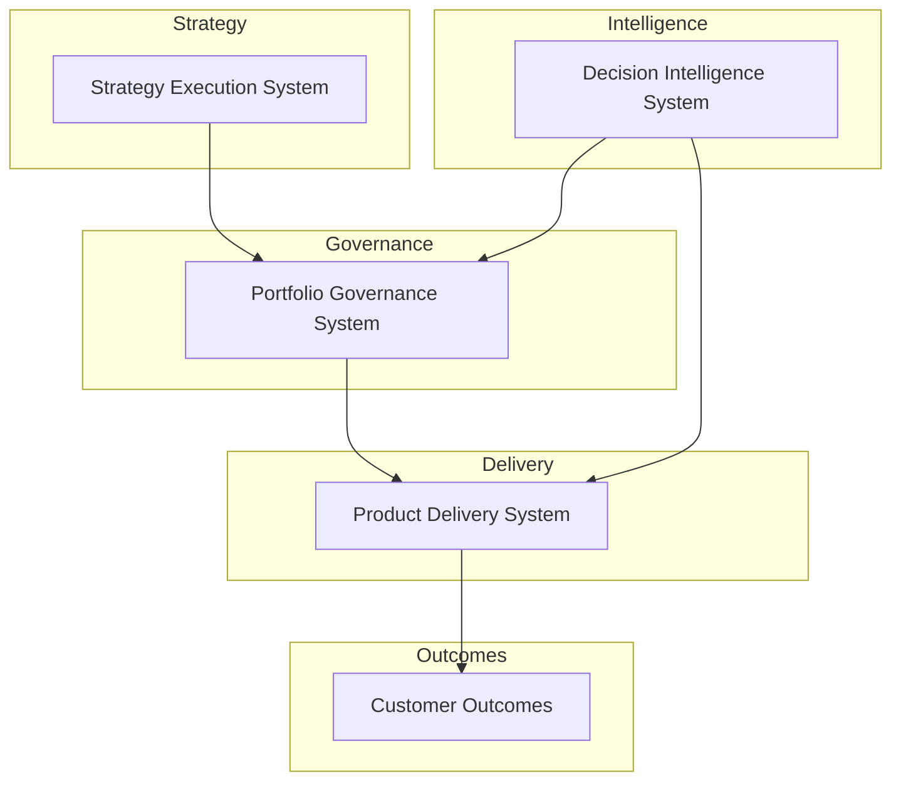

# Product Leadership Systems Architecture


Architecture documentation describing integrated operating systems used to run modern product organizations.

---

## Architecture Overview

The Product Leadership Systems Architecture (PLSA) describes a set of integrated operating systems used to run modern product organizations.

These systems connect strategy execution, portfolio governance, product delivery, and decision intelligence into a unified leadership architecture.

Each repository in this portfolio represents one operating system within the broader architecture.

---

## 10-Second Overview

This portfolio presents a coherent **Product Leadership Systems Architecture**:

- Strategy is translated into investable initiatives
- Investments are governed through portfolio decision systems
- Delivery is executed through a repeatable product operating model
- Outcomes are measured and fed back into governance
- Decision Intelligence augments governance and delivery with AI-assisted analysis

---

## System Architecture Model



---

## Architecture Systems

| System | Primary Outputs | Repository |
|---|---|---|
| Strategy Execution System | Strategy decomposition, initiative definition, planning cadence | https://github.com/ChuckFerrando/strategy-execution-system |
| Portfolio Governance System (Flagship) | Portfolio scoring, capital allocation, risk scoring, investment memos, decision logs, heatmaps | https://github.com/ChuckFerrando/portfolio-governance-system |
| Product Delivery System | Delivery governance, team topology, lifecycle model, operating cadence, metrics | https://github.com/ChuckFerrando/product-delivery-system |
| Decision Intelligence System | AI-assisted scenario modeling, risk detection, decision artifact support | https://github.com/ChuckFerrando/decision-intelligence-system |

---

### How the Systems Work Together

The architecture connects strategy definition, investment governance, and product delivery through structured operating systems.

Strategy Execution Systems define strategic initiatives and candidate investments.

Portfolio Governance Systems evaluate those investments, allocate capital, and manage portfolio risk.

Product Delivery Systems govern the execution of funded initiatives.

Decision Intelligence Systems provide analytics and AI-assisted insights supporting executive decision making.

---

## Documentation Standard

All repositories in this portfolio follow these documentation principles:

- Executive-level tone (concise, authoritative, operational)
- Architecture-first framing (systems, interfaces, decision mechanisms)
- GitHub-compatible Mermaid diagrams (fully fenced ` ```mermaid ` blocks)
- Consistent naming and cross-repository navigation
- Artifact quality resembling internal operating documentation from a large technology organization

This portfolio is intentionally **not**:
- a coding project
- an engineering tutorial
- a PM playbook
- academic writing

---

## License

This repository is released under the MIT License.
